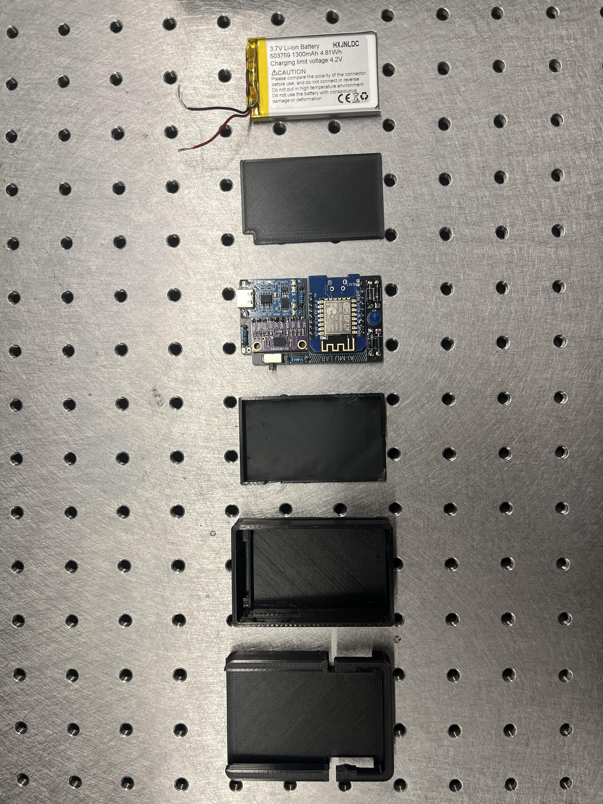
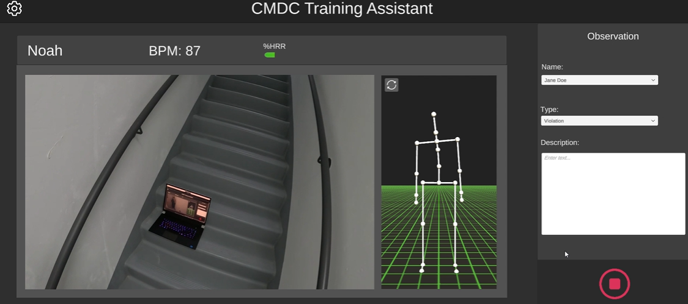
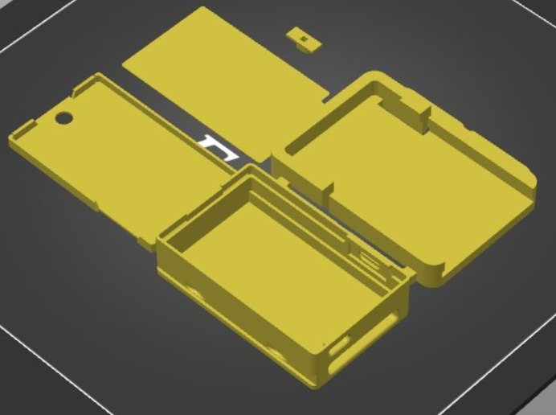

# AI-MU-Motion-Capture

ESP8266 + BNO08x (080/085) based motion capture system that streams IMU data over Wi-Fi into Unity.  
The Unity application performs real-time skeleton reconstruction, visualization, and recording, with the ability to export captured motion to **BVH** for animation workflows.

---

## 📸 Overview

  
*Custom ESP8266 D1 Mini + BNO08x tracker module*

  
*Unity interface showing live skeleton and recording controls*

---

## ✨ Features

- **Low-cost IMU Trackers**: ESP8266 D1 Mini boards with BNO080/BNO085 IMUs.
- **Wi-Fi Data Streaming**: Fast UDP packets (~100 Hz) from multiple trackers.
- **Real-time Visualization**: Unity app reconstructs skeletons live.
- **Calibration Tools**: Mounting error correction + baseline yaw alignment.
- **Multi-Participant Support**: Capture multiple people simultaneously.
- **Recording & Export**: Save sessions and export to **BVH** (for Blender, Unity, Maya, etc.).

---

## 📦 Hardware

Each tracker is built from:

- **ESP8266 D1 Mini (Wemos)**  
- **BNO080 / BNO085 IMU sensor** (I²C connection)  
- **Battery + charging module**  
- 3D printed case (friction-fit lid for quick access)  

📷 Example:  

  
*Friction-fit printed case for tracker module*

---

## 🖥️ Software

- **Firmware**: C++/Arduino code running on each D1 Mini, sending IMU quaternions via UDP.  
- **Unity App**:  
  - Receives tracker data  
  - Maps IMUs to skeleton joints  
  - Provides calibration tools  
  - Records sessions and exports animations  

---

## 🚀 Getting Started

### 1. Clone the Repository
```bash
git clone https://github.com/noah-yacowar/AI-MU-Motion-Capture.git
cd AI-MU-Motion-Capture
